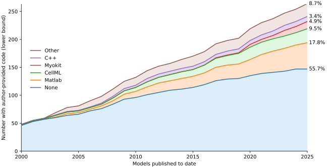
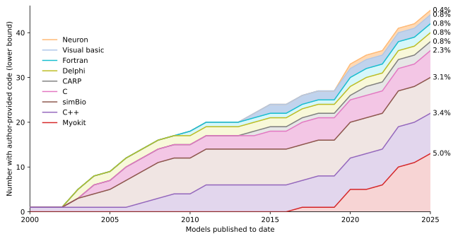
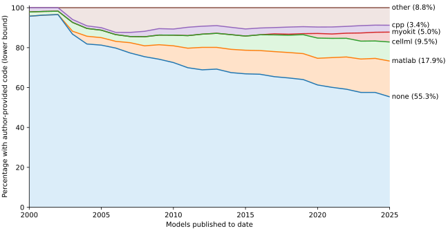
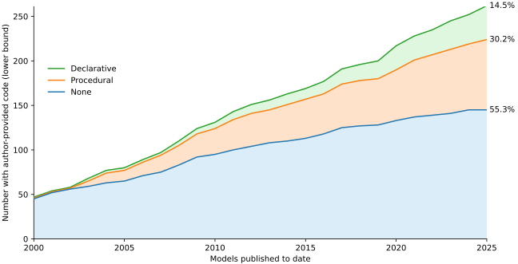
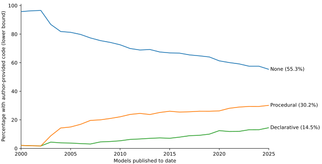

# Figures

Based on the model list (see [here](../README.md) for details of model selection), we can create graphs showing the number of models published over time and the formats the code was published in (if any).

The scripts and their output are included here.

- `check-syntax.py` interprets the model list, turning it into structured data, and verifying that the "syntax" of the model list is correct.
- `show-stats.py` uses this data to print statistics in the terminal
- `plot-code-stats.py` creates the figures shown below.

## Number of publications with author-provided code

The figure below shows the cumulative number of models with author-provided code from 2000 onwards, split by format the code was published in, or "None" if no code could be found online.

As this is based on the manually compiled list, the raw numbers on the left y-axis should be interpreted as a lower bound.
Once a model is known, a targetted search for accompanying code was performed (looking in papers, lab websites, model repositories, and search engines), so that the percentages on the right y-axis are most likely a good approximation.

Another caveat is that code may have been published in other ways, e.g. mailed or emailed before online dissemination became the norm, or may have been removed since online publication.
For this reason, we chose 2000 as the earliest included date.

The "other" category can be split up to reveal the smaller (less than 5%) players:

Note that C and C++ combined make up 5.7% here, and most of the published C++ models make limited use of the extra features found in C++ versus C.

Although **these graphs clearly show the number of models without published code is growing steadily**, some positive developments can be seen if we look purely at _percentages_:

## Code type

Next, we can group languages as either declarative (CellML and Myokit) or procedural (all other languages in the graphs above).
This reveals a steady increase in declarative formats

For this data set, we can also plot the percentage of models _per year_ published with either procedural or declarative code

